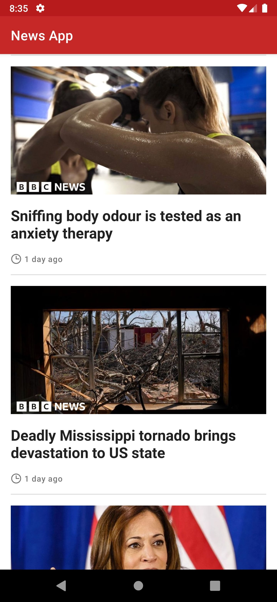

# News App

This is a simple news app that uses the [News API](https://newsapi.org/) to fetch news articles from
BBC News sources.
It is built using the [MVVM architecture](https://developer.android.com/jetpack/docs/guide)
and [Android Jetpack](https://developer.android.com/jetpack).

## Getting Started

Register for an API key from [News API](https://newsapi.org/register) and set up your key
in the `local.properties` file as follows:

```
API_KEY=YOUR_API_KEY
```

You can build `news` or `sports` flavor to get news from `BBC News` or `BBC Sport`
respectively.

## Screenshots

|            General News            |                   Sport News                   |
|:----------------------------------:|:----------------------------------------------:|
|  |  |
